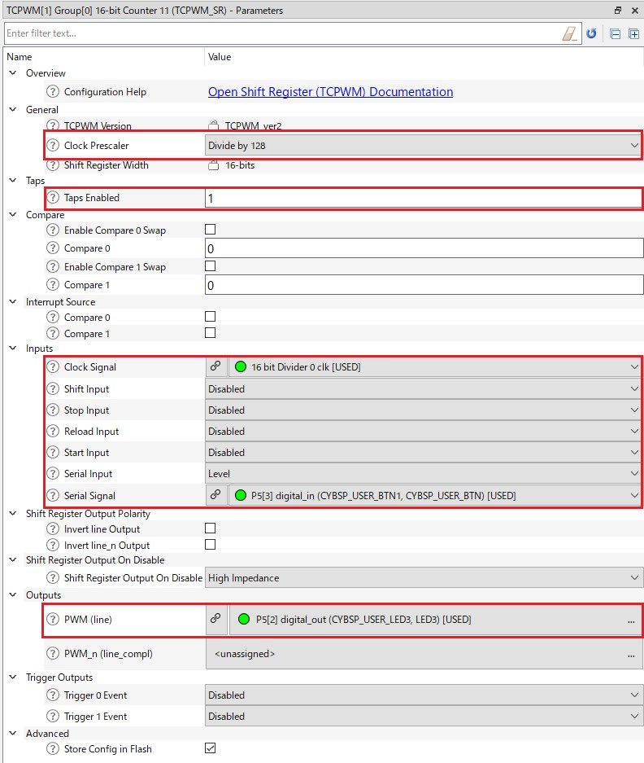

# TCPWM Shift Register mode

**This code example demonstrates the delayed signal generation using Shift Register (SR) mode.**  

## Device

The device used in this code example (CE) is:
- [TRAVEO™ T2G CYT4BF Series](https://www.infineon.com/cms/en/product/microcontroller/32-bit-traveo-t2g-arm-cortex-microcontroller/32-bit-traveo-t2g-arm-cortex-for-body/traveo-t2g-cyt4bf-series/)

## Board

The board used for testing is:
- TRAVEO™ T2G evaluation kit ([KIT_T2G-B-H_LITE](https://www.infineon.com/cms/en/product/evaluation-boards/kit_t2g-b-h_lite/))

## Scope of work

The SR functionality shifts the counter value in the right direction. The capture0 input is used to generate the MSB of the next counter value. The line output signal is driven from a programmable tab of the counter. In this example, the capture0 is assigned to the user button of the kit and the line output is assigned to the user LED of the kit as well, so the LED will light up about 0.5s later from the press of the button.

## Introduction  

**TCPWM**  
TRAVEO™ T2G platform supports the following TCPWM features:

- Supports up to four counter groups (device specific)
- Each counter group consists up to 256 counters (counter group specific)
- Each counter can run in one of seven function modes:
    - Timer-counter with compare
    - Timer-counter with capture
    - Quadrature decoding
    - Pulse width modulation/stepper motor control (SMC) for pointer instruments
    - PWM with dead time/three-phase motor control (Brushless-DC, BLDC)
    - Pseudo-random PWM
    - Shift register mode
- 16-bit or 32-bit counters (counter group specific)
- Up, down, and up/down counting modes
- Clock prescaling (division by 1, 2, 4, ... 64, 128)
- Up to two capture and compare functions (counter group specific)
- Double buffering of all compare/capture and period registers
- Two output trigger signals for each counter to indicate underflow, overflow, and capture/compare events; they can also directly be connected with the line output signal
- Supports interrupt on:
    - Terminal Count - Depends on the mode; typically occurs on overflow or underflow
    - Capture/Compare - The count is captured in the capture registers or the counter value equals the value in the compare register
- Line out selection feature for stepper motor application including two complementary output lines with dead time insertion
- Selectable start, reload, stop, count, and two capture event signals for each TCPWM with rising edge, falling edge, both edges, and level trigger options
- Each counter with up to 254 (device specific) synchronized input trigger signals and two constant input signals: '0' and '1'.
- Two types of input triggers for each counter: 
    - General-purpose triggers used by all counters 
    - One-to-one triggers for specific counter
- Synchronous operation of multiple counters
- Debug mode support

More details can be found in [Technical Reference Manual (TRM)](https://www.infineon.com/products/microcontroller/32-bit-traveo-t2g-arm-cortex/for-body/t2g-cyt4bf#documents), [Registers TRM](https://www.infineon.com/products/microcontroller/32-bit-traveo-t2g-arm-cortex/for-body/t2g-cyt4bf#documents) and [Data Sheet](https://www.infineon.com/products/microcontroller/32-bit-traveo-t2g-arm-cortex/for-body/t2g-cyt4bf#documents).

## Hardware setup

This CE has been developed for:
- TRAVEO™ T2G Body High Lite evaluation kit ([KIT_T2G-B-H_LITE](https://www.infineon.com/cms/en/product/evaluation-boards/kit_t2g-b-h_lite/)) 
 
No changes are required from the board's default settings.

**Pins list**
<table border="1" style="border-collapse: collapse">
<thead><tr>
<th>Board</th><th>User button</th><th>User LED</th></tr></thead>
<tbody>
<tr><td><code>KIT_T2G-B-H_LITE</code></td><td>USER_BTN1, P5.3 (TC1_11_TR1)</td><td>USER_LED3, P5.2 (PWM1_11)</td></tr>
</tbody>
</table>

## Implementation

The SR mode of TCPWM is configured by Device Configurator. The user button is configured as a 16-bit TCPWM capture input. The state of the captured input signal is output to the user LED with a delay of 16 clock cycles by the shift register. Since the operating clock is set to 32Hz, the delay time from pushing the button to the LED turns on is approximately 0.5 second.

**TCPWM Configuration**

The configuration is done in a custom design.modus file. This can be opened by Device Configurator, also can be modified.

- The `Taps Enabled` value is set to 1 to make the line out as 16 cycles delay of the captured input signal.
- The `Inputs/Serial Signal` and `Outputs/PWM (line)` are set to the kit specific user button and user LED respectively. See the Pins list in Hardware setup

**Initialize and enable the TCPWM**

- Initialization of the TCPWM SR is done once in the <a href="https://infineon.github.io/mtb-pdl-cat1/pdl_api_reference_manual/html/group__group__tcpwm__functions__shiftreg.html#gac0b638d2ea8e28da947179477295d40b"><i>Cy_TCPWM_ShiftReg_Init()</i></a> function with the structure *TCPWM_SR_config* output by Device Configurator
- Then enables the TCPWM SR in the <a href="https://infineon.github.io/mtb-pdl-cat1/pdl_api_reference_manual/html/group__group__tcpwm__functions__shiftreg.html#ga66d1c366130d20469af69a2d41016727"><i>Cy_TCPWM_ShiftReg_Enable()</i></a> function

**Start the TCPWM SR**

- Starts the TCPWM SR in the <a href="https://infineon.github.io/mtb-pdl-cat1/pdl_api_reference_manual/html/group__group__tcpwm__functions__common.html#gaafe86ec440bec9a2c23392f289cc3a8b"><i>Cy_TCPWM_TriggerStart_Single()</i></a> function

## Run and Test

After code compilation, perform the following steps to flashing the device:

1. Program the board using one of the following:
    - Select the code example project in the Project Explorer.
    - In the **Quick Panel**, scroll down, and click **[Project Name] Program (KitProg3_MiniProg4)**.
2. After programming, the code example starts automatically.
3. Press USER_BTN1(USER1), then USER_LED3(LED5) lights up after approximately 0.5 seconds.
4. You can debug the example to step through the code. In the IDE, use the **[Project Name] Debug (KitProg3_MiniProg4)** configuration in the **Quick Panel**. For details, see the "Program and debug" section in the [Eclipse IDE for ModusToolbox™ software user guide](https://www.infineon.com/MTBEclipseIDEUserguide).

**Note:** **(Only while debugging)** On the CM7 CPU, some code in `main()` may execute before the debugger halts at the beginning of `main()`. This means that some code executes twice ? once before the debugger stops execution, and again after the debugger resets the program counter to the beginning of `main()`. See [KBA231071](https://community.cypress.com/docs/DOC-21143) to learn about this and for the workaround.

## References  

Relevant Application notes are:
- [AN235305](https://www.infineon.com/gated/infineon-an235305-getting-started-with-traveo-t2g-family-mcus-in-modustoolbox-applicationnotes-en_ef8d5799-c199-4f23-83a2-4fd63183071f) - GETTING STARTED WITH TRAVEO™ T2G FAMILY MCUS IN MODUSTOOLBOX™
- [AN224434](https://www.infineon.com/gated/infineon-an224434-clock-configuration-setup-in-traveo-t2g-body-high-family-applicationnotes-en_80cf38a4-3eb2-43d9-b7fb-8ec94120dfd2) - Clock configuration setup in TRAVEO™ T2G family CYT4B series
- [AN220224](https://www.infineon.com/gated/infineon-an220224---how-to-use-timer-counter-and-pwm-tcpwm-in-traveo-t2g-family-ja-applicationnotes-ja_8c2c5500-27ae-4f7f-9677-f6b10f19328d) - How to Use Timer, Counter, and PWM (TCPWM) in Traveo II Family

ModusToolbox™ is available online:
- <https://www.infineon.com/modustoolbox>

Associated TRAVEO™ T2G MCUs can be found on:
- <https://www.infineon.com/cms/en/product/microcontroller/32-bit-traveo-t2g-arm-cortex-microcontroller/>

More code examples can be found on the GIT repository:
- [TRAVEO™ T2G Code examples](https://github.com/orgs/Infineon/repositories?q=mtb-t2g-&type=all&language=&sort=)

For additional trainings, visit our webpage:  
- [TRAVEO™ T2G trainings](https://www.infineon.com/training/microcontroller-trainings)

For questions and support, use the TRAVEO™ T2G Forum:  
- <https://community.infineon.com/t5/TRAVEO-T2G/bd-p/TraveoII>  
